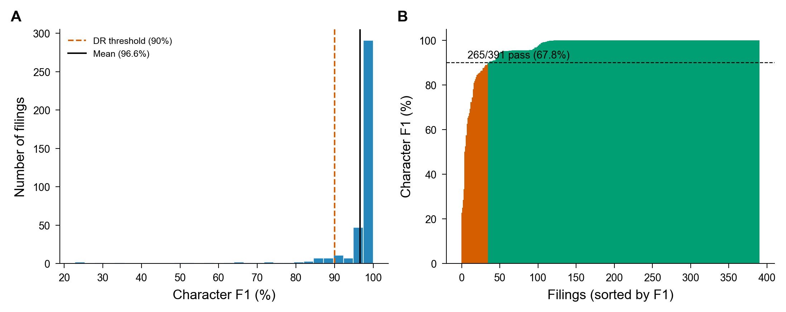
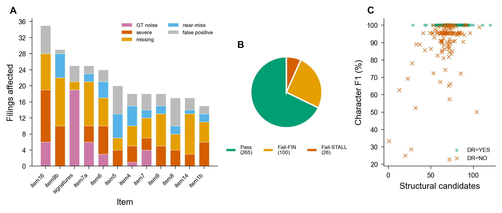
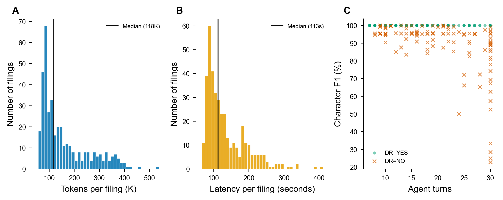

# Agentic 10-K Itemization

LLM agent loop for extracting standardized item sections from SEC 10-K filings.

Unlike deterministic rule-based approaches, this system uses an LLM agent in a **think-act-observe** loop, iteratively querying a precomputed structural index through 17 specialized tools and self-correcting via validation feedback.

## Results

**391 filings | DeepSeek-V3.2 | $0.045/filing**

| Metric | Value |
|--------|-------|
| Mean Character F1 | 96.6% |
| Noise-Adjusted DR | **73.9%** (289/391) |
| Cost per Filing | $0.045 (4.5 cents) |
| Total Corpus Cost | $17.59 |
| Median Latency | 113s |
| Median Turns | 13 |

### Performance Overview



**(A)** F1 distribution -- massive spike at 100%, thin left tail of failures. **(B)** Filings sorted by F1 -- 289/391 pass the 90% DR threshold after noise adjustment.

### Failure Analysis



**(A)** Failure types per item -- GT noise (purple) dominates item16/signatures; real errors concentrate on item9b, item7a, item6. **(B)** 265 pass, 100 fail-but-finalized, 26 stalled at max turns. **(C)** Structural candidates vs F1 -- failures cluster at low candidate counts, confirming index quality as the bottleneck.

### Cost & Latency



**(A)** Tokens per filing -- right-skewed, median 118K. **(B)** Latency -- median 113s. **(C)** Agent turns vs F1 -- failures concentrate at 25-30 turns (agent spiraling on hard filings).

## Architecture

```
Filing (.txt) --> Structural Index --> Agent Loop --> Assignments --> HTML Slicer --> Predictions
                 (~200ms, no LLM)    (10-30 turns)                  (instant)
```

### Phase 1: Structural Index (~200ms, no LLM)

Precomputes all signals the agent queries:
- TOC link extraction and classification (tier-1/tier-2 regex)
- Anchor localization across all HTML tag types
- Candidate scoring (confidence 0-10) with Part-region adjustment
- Part III incorporation detection

### Phase 2: Agent Loop (10-30 turns)

Think-act-observe loop with 17 tools:

| Category | Tools |
|----------|-------|
| Discovery | `get_filing_overview`, `get_toc_links`, `get_item_candidates`, `get_all_top_candidates`, `get_part_boundaries` |
| Classification | `classify_text`, `detect_incorporation` |
| Assignment | `assign_item`, `unassign_item`, `batch_assign`, `get_current_assignments` |
| Validation | `validate_assignments`, `check_span_sizes` |
| Refinement | `read_text_at`, `refine_boundary`, `scan_for_heading`, `finalize` |

**Model:** DeepSeek-V3.2 via OpenRouter (temperature 0, max 30 turns)

**System prompt:** ~2,450 characters. Minimal and directive -- longer prompts cause the agent to overthink.

## Project Structure

```
agentic-10-k/
  pipeline/                # Core agentic pipeline
    agent/
      index.py             # Structural index builder (509 lines)
      loop.py              # Agent loop -- think-act-observe (359 lines)
      tools.py             # 17 tool implementations (713 lines)
      state.py             # Immutable assignment state (171 lines)
      validation.py        # Assignment validation (177 lines)
      runner.py            # Batch runner + HTML slicer (324 lines)
      prompts.py           # System/task prompts (80 lines)
    config.py              # Constants, paths, item ordering
  archive/                 # Original extraction functions (extract.py, evaluate.py)
  experiments/             # All experiment results + figures
    baseline_deepseek_391/ # Full corpus baseline
    baseline_deepseek_50/  # 50-filing baseline
    v5_minimax_50/         # minimax-m2.7 experiment
    v6_deepseek_fixes_50/  # deepseek + heading scan + checkpoint
    figures/               # Publication-quality visualizations
  docs/                    # Technical reports, LaTeX, GT noise inventory
  scripts/                 # Debug, analysis, visualization tools
  run_test50.py            # 50-filing test runner (parallel)
  run_test100.py           # 100-filing test runner (parallel)
  run_all.py               # Full 391-filing runner (parallel)
  evaluate.py              # Evaluation metrics (char F1, DR)
```

## Setup

```bash
# Clone
git clone https://github.com/ericnerwala/agentic-10-k.git
cd agentic-10-k

# Install dependencies
pip install openai python-dotenv

# Set API key
echo "OPENROUTER_API_KEY=sk-or-..." > .env

# Symlink data (not included in repo)
ln -s /path/to/10K/data ./data

# Run on 50 filings
python run_test50.py
```

## Key Lesson

> *Improve what the agent sees, not what it is told.*

The only change across 6 iterations that improved DR was Part-region confidence scoring in the structural index. Longer prompts, additional tools, pre-populated state, single-shot LLM calls, heading scans, checkpoints, and model swaps all regressed or broke even.

The bottleneck is structural index quality, not agent reasoning.

## Technical Report

Full 10-page report with methodology, figures, failure analysis, GT noise inventory, and lessons learned:

[docs/agentic_10k_report.pdf](docs/agentic_10k_report.pdf)
